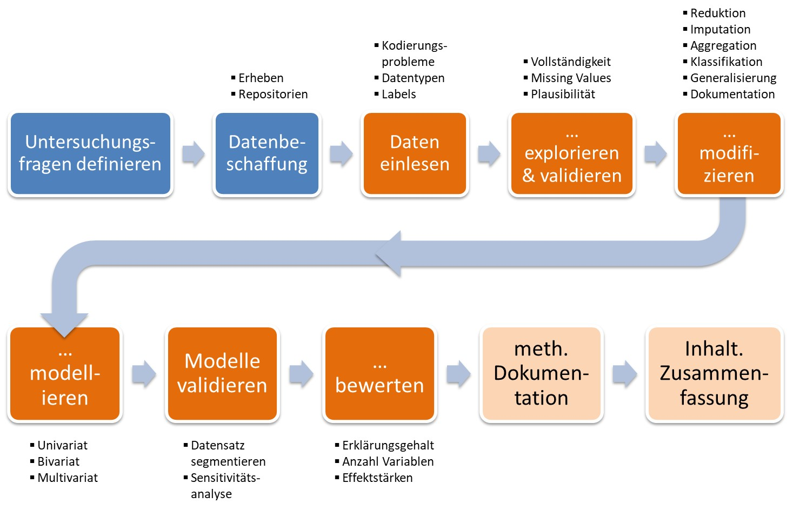

# Warmup 2: Wissenschaftliche Datenanalyse

## 📢 Zielsetzung dieser Einheit {.unnumbered}

In dieser Einheit werden zunächst die unterschiedlichen **Phasen** eines idealtypischen **Analyseprozesses** dargelegt. in einem zweiten Schritt werden wir die Implikationen **wissenschaftlicher Qualitätskriterien** für einen solchen Analyseprozess behandeln. Dabei legen einen Schwerpunkt auf die Phase der **Datenbeschaffung**.

------------------------------------------------------------------------

## Daten analysieren - aber wie?

Unabhängig vom gewählten statistischen Verfahren, bestehen Datenanalysen aus einer Abfolge unterschiedlicher **Arbeitsschritte**:

{.videoframe .fullscreen-enabled}

Dieser hier idealtypisch dargestellte Workflow muss dabei nicht zwingend linear durchlaufen werden. Die Farbgebung in obiger Darstellung deutet bereits an, dass wir in diesen Prozess drei große Abschnitte unterscheiden können:

1.  Die initiale **Datenbeschaffung**
2.  Die **Aufbereitung und Analyse** dieser Daten
3.  Die **Dokumentation** der erzeugten Daten und Ergebnisse

## Anforderungen an eine wissenschaftliche Datenanalyse

Damit Analysen den Anspruch auf Wissenschaftlichkeit erheben können, müssen sie einer Reihe von Kriterien - beispielsweise jenen einer [Offenen Wissenschaft ("Open Science")](https://open-science-training-handbook.gitbook.io/book/) - genügen. Einen ersten Einblick in diese Kriterien bieten (neben dem obigen Link) folgende Folien:

```{r echo=FALSE}
mySlideshow <- "eh4_warmup2a_wissenschaftlich"
mySlideWidth <- 600
mySlideHeight <- 450

knitr::asis_output(paste(
  "<iframe src=\"https://kamihoeferl.at/lehre/vu_sozwiss2_slides/",
  mySlideshow,
  ".html#1\" width=\"",
  mySlideWidth,
  "px\" height=\"",
  mySlideHeight,
  "px\" class=\"videoframe\" allowfullscreen>Your browser doesnot support iframes <a href=\"<https://kamihoeferl.at/lehre/vu_sozwiss2_slides/",
  mySlideshow,
  ".html#1\">click here to view the page directly.</a></iframe>", sep = ""))
knitr::asis_output(paste(
  "<div><a href=\"https://kamihoeferl.at/lehre/vu_sozwiss2_slides/",
  mySlideshow,
  ".pdf\">Die Slides als PDF</a></div>",
  sep = ""))
```

## Daten finden und validieren

Aber nicht nur das Abarbeiten der einzelnen Analyseschritte, sondern auch die dabei genutzten Datensätze müssen wissenschaftlichen Kriterien genügen. Wie wir **Sekundärdaten erschließen** und deren **Qualität beurteilen** können, findet sich in diesen Folien:

```{r echo=FALSE}
mySlideshow <- "eh4_warmup2b_datenqualitaet"
mySlideWidth <- 600
mySlideHeight <- 450

knitr::asis_output(paste(
  "<iframe src=\"https://kamihoeferl.at/lehre/vu_sozwiss2_slides/",
  mySlideshow,
  ".html#1\" width=\"",
  mySlideWidth,
  "px\" height=\"",
  mySlideHeight,
  "px\" class=\"videoframe\" allowfullscreen>Your browser doesnot support iframes <a href=\"<https://kamihoeferl.at/lehre/vu_sozwiss2_slides/",
  mySlideshow,
  ".html#1\">click here to view the page directly.</a></iframe>", sep = ""))
knitr::asis_output(paste(
  "<div><a href=\"https://kamihoeferl.at/lehre/vu_sozwiss2_slides/",
  mySlideshow,
  ".pdf\">Die Slides als PDF</a></div>",
  sep = ""))
```

------------------------------------------------------------------------

🏆 **Nun wissen wir, ...**

-   welche **Schritte** eine Datenanalyse ausmachen.
-   welchen **wissenschaftlichen Qualitätskriterien** das Abarbeiten dieser Schritte zu genügen hat.
-   wie wir **Sekundärdaten erschließen** können.
-   welche **Qualitätsanforderungen** an die dabei genutzten **Daten** erfüllt sein müssen.

And now it's **time for some action** ...

{.videoframe width="210"}
