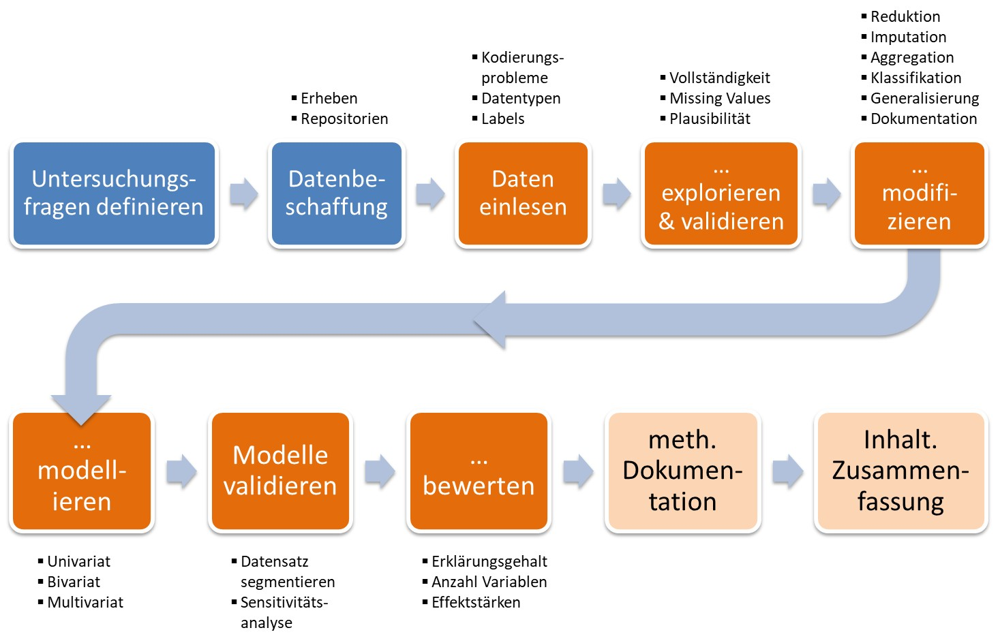

# Addendum 1: Spreading the Word

## 📢 Zielsetzung dieser Einheit {.unnumbered}

Diese Einheit soll einen kurzen Überblick darauf geben, wie man mittels RStudio Berichte zu seinen Analysen erstellen kann.

---

## Prolog {#prolog}

Wie so oft, gibt es nicht die "eine" Möglichkeit, um aus seine Analysen aus Rstudio in schicke Berichte zu überführen. Bevor wir uns in diese Möglichkeiten vertiefen wollen, zunächst noch ein paar Worte zur Frage nach dem generellen "Warum?".

Werfen wir dazu einen Blick auf den in Einheit \@ref(warmup-2-wissenschaftliche-datenanalyse) behandelten idealtypischen Analysewerkflow:

{.videoframe}

Spätestens bei den letzten beiden Schritten rückt die **Erstellung von Berichten und Präsentationsmaterialien** in den Vordergrund. Da sich viele Fragestellungen oftmals nicht innerhalb eines Nachmittags bearbeiten lassen, ist eine **laufende Dokumentation** des Arbeitsfortschritts (inkl. offener Fragen etc.) die beste Grundlage für solche Berichte. Um uns bei beim Dokumentieren und Erstellen von Berichten zu unterstützen, bietet RStudio mehrere Möglichkeiten, Ergebnisse in unterschiedliche Ausgabeformate zu überführen. Die Spannweite reicht dabei von einfachen [Reports](https://rmarkdown.rstudio.com/articles_report_from_r_script.html), über [Notebooks](https://rmarkdown.rstudio.com/lesson-10.html) und [Slides](https://rmarkdown.rstudio.com/lesson-11.html) bis hin zu ganzen [Buchprojekten](https://bookdown.org/), [Blogs](https://bookdown.org/yihui/blogdown/) oder [interaktiven Webanwendungen](https://shiny.rstudio.com/).

Welches dieser Ausgabeformate das **"richtige"** ist, hängt von vielen Faktoren ab:

-   dem Zielpublikum;

-   den zur Verfügung stehenden technischen Ressourcen;

-   dem verfügbaren zeitlichen Rahmen;

-   persönlichen Vorlieben;

-   etc.

Unabhängig von der konkreten Entscheidung für ein Ausgabeformat, wollen wir hier einen Überblick auf einige der **populärsten Formate** wagen:

## Keep it simple & compile

Die wohl einfachste Art ein bestehendes Skript in RStudio mitsamt der darin erzeugten Daten und Abbildungen als Rohbericht abzulegen, bietet die Funktion **"Compile Report"** in Rstudio:

{.videoframe width="400"}

Über diese Funktion kann können wir dieses einfache Skript ...

    # Create the data for the chart
    H <- c(7,12,28,3,41)

    # Plot the bar chart
    barplot(H)

... als in eine **HTML-Datei** ...

{.videoframe width="400"}

... oder eine **Word-Datei** umwandeln:

{.videoframe width="400"}

## Vom Skript zum Markdown

R Markdown ermöglicht es, [Markdown](https://de.wikipedia.org/wiki/Markdown) Anweisungen mit R-Code zu kombinieren.

**🤔 Aber was ist Markdown?**

Markdown ist eine vereinfachte Auszeichnungssprache mit dem Ziel, den Inhalt eines Dokuments von seiner Darstellung zu trennen und gleichzeitig offene, leicht lesbare Textdokumente zu nutzen. [Wikipedia](https://de.wikipedia.org/wiki/Markdown) bietet einen guten Einstieg in das Thema Markdown. Ein beleibtes Tool um Markdown-Dokumente in unterschiedlichen Ausgabeformate zu überführen ist [Pandoc](https://pandoc.org).

Aber zurück zu R Markdown:

```{=html}
<iframe class="videoframe" src="https://player.vimeo.com/video/178485416?color=428bca" width="640" height="400" frameborder="0" allow="fullscreen" allowfullscreen></iframe>
```

R Markdown nutzt also die Auszeichnungselemente von Markdown und erweitert diese (über das Package [knitr](https://yihui.org/knitr/)) um sgn. **"Code-Chunks"**, also ausführbare R Statements. Diese Erweiterung soll eine offene und nachvollziehbare Dokumentation von Analysen ermöglichen.

Wanna know more?

-   Eine kurzweilige **Einführung** bieten die MacherInnen von RStudio hier:  
https://rmarkdown.rstudio.com

-   Wie immer, gibt es auch **Kurzreferenzen** für die tl;dr-Fraktion. Diese können direkt aus RStudio aufgerufen werden:\
    {.videoframe width="400"}\
    Das **Cheat Sheet** bietet detailliertere Informationen, die **Quick Reference** einen guten ersten Überblick.

-   Und um für alle Fälle gerüstet zu sein, noch zwei Literatur-Tipps:

    -   **R Markdown: The Definitive Guide**  
    https://bookdown.org/yihui/rmarkdown

    -   **R Markdown Cookbook**  
    https://bookdown.org/yihui/rmarkdown-cookbook

**👉 Wie bei vielen Aspekten von R so auch hier:**\
Probieren Sie es einfach einmal aus. Der schnellste Weg dazu:\
{.videoframe}

## Ein Tipp: R Notebooks

[R Notebooks](https://bookdown.org/yihui/rmarkdown/notebook.html) sind R Markdown-Dokumente, die den Fokus auf das Verknüpfen von Dokumentation und das interaktive Ausführen von Code-Chunks legen. Das dafür in RStudio präferierte Ausgabeformat HTML ermöglicht per default

-   das Ein- und Ausblenden der eingebetteten R-Statements sowie
-   den Download des R Notebooks (als ausführbare RMD-Datei) selbst.

In RStudio können Sie so über das Viewer-Fenster stets einen Blick auf Ihre Auswertung werfen und laufend Änderungen an Ihrem Analysecode vornehmen:

{width="900"}

Da Notebooks eine spezielle Spielart von R Markdown sind, stehen die bekannten Ausgabeformate HTML, PDF und DOCX zur Verfügung.

**👉 Auch gilt wieder wieder:**\
Probieren geht über Studieren 😉 Am schnellsten via:\
{.videoframe}

## Den Nutzung von R Markdown vorbereiten

Um den Export von R Markdown-Dokumenten besser zu verstehen, lohnt sich ein kurzer Blick auf die dafür notwendigen Schritte und Packages. Der Export von R Markdown erfolgt für HTML- und DOCX-Output in zwei, für einen PDF-Export in drei Schritten:

{.videoframe width="70%"}

1.  Das Package [knitr](https://cran.r-project.org/web/packages/knitr/index.html) übernimmt die **Einbettung von Code-Chunks** in ein Markdown-Dokument (Dateierweiterung: MD).

2.  Dieses Markdown-Dokument kann danach mittels des Packages [rmarkdown](https://cran.r-project.org/web/packages/rmarkdown/index.html) in

    -   ein Latex-Dokument (.tex);
    -   ein MS Word-Dokument (.docx) oder
    -   ein HTML-Dokument

    **überführt** werden.

3.  **Spezialfall PDF:** Das Package [tinytex](https://cran.r-project.org/web/packages/tinytex/index.html) ermöglicht es, Latex-Dokumente in PDF zu überführen. Hintergrundwissen zum Thema LaTex findet sich bei [Wikipedia](https://de.wikipedia.org/wiki/LaTeX).

### Installation der benötigten Packages

Um R Markdown nutzen zu können, müssen die zuvor beschriebenen Packages installiert werden.

#### Das Package *knitr* installieren

Um zu prüfen, ob das Package bereits installiert ist, versucht man am einfachsten dieses zu laden:

```{r Check knitr, error=TRUE}
library(knitr)
```

Sollte ein Fehler auftreten muss das Package installiert werden:

```{r Package knitr installieren, eval=FALSE}
install.packages("knitr")
```

#### Das Package *rmarkdown* installieren

Dieses Package sollte bereits in der RStudio-Installation enthalten sein. Ein kurzer Test, ob das Package verfügbar ist, schadet jedoch nicht:

```{r Check rmarkdown, error=TRUE}
library(rmarkdown)
```

Sollte eine Fehlermeldung auftreten, muss das Package installiert werden:

```{r Package rmarkdown installieren, eval=FALSE}
install.packages("rmarkdown")
```

#### Für den PDF Export: Das Package *tinytex* installieren

> **👉 Ein freundlicher Hinweis:**\
> Das Erzeugen von PDF-Dateien ist nicht trivial. Aus persönlicher Erfahrung stößt man bei dem hier beschriebenen Vorgang zur Installation von tinytex oftmals auf unvorhersehbare Hindernisse. Ein Blick in diverse R-Foren zeigt, dass man damit nicht alleine ist.
>
> Was man dabei nicht vergessen sollte: Der Export von R Markdown-Dokumenten in PDF-Dateien kann natürlich auch über den "Umweg" eines HTML- oder DOCX-Exports erfolgen. Speziell im Falle eines DOCX-Exportes können so noch Änderungen eingearbeitet und anschließen ein Export in eine PDF-Datei vorgenommen werden.

Zunächst überprüfen wir wieder, ob das tinytex Package und seine pdflatex-Komponenten **bereits installiert** sind:

```{r CheckTinytex}
library(tinytex)
Sys.which('pdflatex')
```

> **👉 Hint:**\
> Je nach Betriebssystem (hier: Windows) sieht die Pfadangabe zu den pdflatex-Komponenten natürlich anders aus.

Sollte der Library-Aufruf in einem Fehler münden und/oder keine pdflatex-Komponenten gefunden werden, muss das Package **installiert** werden:

```{r InstallTinytex1, eval=FALSE}
install.packages('tinytex')
```

Im Gegensatz zu den meisten Packages, muss tinytex nach seiner Installation noch einige Dateien systemweit zur Verfügung stellen. Dazu muss **einmalig die systemweite Installation angestoßen** werden:

```{r InstallTinytex2, eval=FALSE}
tinytexinstall_tinytex()
```

Danach empfiehlt es sich, RStudio zu schließen und neu zu starten. Ob die Installation erfolgreich war, verrät ein erneutes Überprüfen des Pfades zu den pdflatex-Komponenten:

```{r CheckTinytex2}
Sys.which('pdflatex')
```

Nun können in einem letzten Schritt über das Menü **"Tools \> Global Options..."** in der Sektion **"Sweave"** folgende Einstellungen vorgenommen werden:

-   Typeset LaTeX into PDF using: pdfLaTeX
-   Use tinytex when compiling .tex files

{.videoframe width="70%"}

## There ist more ...

Mit Hilfe diverser Packages können noch weitere (meist komplexere) markdownbasierte Ausgabeformate realisiert werden. Ob diese Formate für den eigenen Gebrauch sinnvoll erschienen, hängt nicht zuletzt von den einleitend im [Prolog](#prolog) genannten Überlegungen ab.

Hier eine Auswahl:

-   **Bücher mittels bookdown erstellen:**\
    Das [bookdown](https://bookdown.org/) Package ermöglicht es, mehrere R Markdown-Dokumente in einem Buch oder Bericht zu vereinigen. Es eignet sich somit für größere Vorhaben, wie beispielsweise dieses WorkBook 😉\
    Ein guten Einstieg bietet Yihuie Xie in [bookdown: Authoring Books and Technical Documents with R Markdown](https://bookdown.org/yihui/bookdown/)

-   **Präsentation mittels R Markdown erstellen:**  
    Ja, geht natürlich:  
    ```{r, echo=FALSE, purl=FALSE}
    mySlideshow <- "eh7_cluster_basics"
    mySlideWidth <- 400
    mySlideHeight <- 300
    
    knitr::asis_output(paste(
      "<iframe src=\"https://kamihoeferl.at/lehre/vu_sozwiss2_slides/",
      mySlideshow,
      ".html#1\" width=\"",
      mySlideWidth,
      "px\" height=\"",
      mySlideHeight,
      "px\" class=\"videoframe\" allowfullscreen>Your browser doesnot support iframes <a href=\"<https://kamihoeferl.at/lehre/vu_sozwiss2_slides/",
      mySlideshow,
      ".html#1\">click here to view the page directly.</a></iframe>", sep = ""))
    ```  
    
    **Warum?** Weil man damit HTML-Präsentationen erzeugen kann. Diese lassen sich einfach in bestehende Webseiten integrieren. Zum **"Wie?"** bieten folgende Stellen Trost und Hilfe:
    
    + Ein erster Einstieg von den RStudio-MacherInnen:  
    https://support.rstudio.com/hc/en-us/articles/200486468-Authoring-R-Presentations
    + Technisch können Präsentation mittels unterschiedlicher Frameworks umgesetzt werden:
      * Einfache Präsentationen können als ioslides umgesetzt werden:  
      https://garrettgman.github.io/rmarkdown/ioslides_presentation_format.html
      * Wer gerne detaillierter die Gestlatung seiner Folien bestimmen möchte, dem sei xaringan empfohlen: https://slides.yihui.org/xaringan/#1

------------------------------------------------------------------------

🏆 **Nun wissen wir, dass ...**

-   Markdown ziemlich praktisch ist.

{.videoframe width="210"}

**Und macht (nicht nur) den Captain happy 😎**
