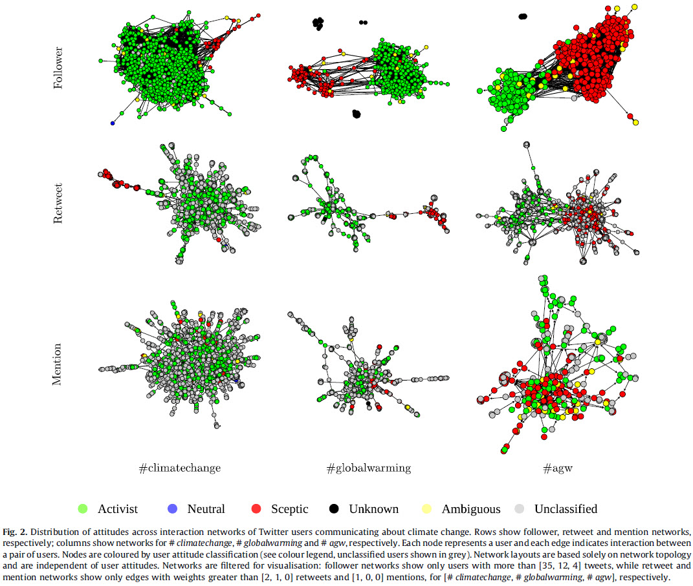

```{r xaringanExtras, echo=FALSE}
xaringanExtra::use_share_again()  # für die Buttons zur Navigation
xaringanExtra::use_tile_view()    # für den Overview auf die Slides
```
class: zwischentitel , center, middle

# .emolarge[🤔]<br>Rechnen mit Texten ...<br> geht das? 

---
# .font70[Welche Methoden gibt es überhaupt - eine Auswahl:]

```{r echo=FALSE}
knitr::asis_output('<div class="container">')
knitr::include_graphics ("images/eh2_intro/ImageSlide_29.png")
knitr::asis_output("</div>")
```
.quelle[(Überarbeitung von: Reuber & Pfaffenbach 2005:21)]

---

# Kulturelle Rahmungen

*„Framing is a way of selecting, organizing, interpreting, and making sense of a complex reality to provide guideposts for knowing, analyzing, persuading and acting.”* (REIN und SCHÖN, 1993:146)

```{r echo=FALSE}
knitr::asis_output('<div class="container350">')
knitr::include_graphics ("images/eh2_intro/EH2_intro_S30_11.png")
knitr::asis_output("</div>")
```
.quelle[[(Fotografia DSLR, o.J.)](https://fotografiadslr.files.wordpress.com/2014/04/semana_5.jpg)]

---

# .font70[Wie kann ich kulturelle Rahmungen untersuchen?]

.pull-left[

**Diskursanalyse:**

*"ensemble of ideas, concepts, and categories through which meaning is given to social and physical phenomena, and which is produced and reproduced through an identifiable set of practices"*  
(Hajer, 2005:300) 

]

.pull-right[

```{r echo=FALSE}
knitr::asis_output('<div class="container">')
knitr::include_graphics ("images/eh2_intro/michel-foucault.jpg")
knitr::asis_output("</div>")
```
.quelle[([Picture-Alliance, o.J.](https://www.faz.net/aktuell/feuilleton/debatten/zu-den-vorwuerfen-der-philosoph-michel-foucault-habe-kindesmissbrauch-begangen-17285759/michel-foucault-1926-1984-17285928.html))]

]

---

# Oftmals: Nonreaktive Datengwinnung

.spacing06[

Ziel: **Korpusbildung** 🡒 Zugang (meist) über Repositorien

+ Bibliotheken & Archive
+ Zeitungen & TV
    - BSP: APA DeFacto Campus
+ Archive von Institutionen:
    - Landtage, Parlamente
    - Landes- & Kommunalverwaltungen
+ Bilddatenbanken
+ Eingeschränkter „direkter“ Zugang:
    + Soziale Medien (Facebook, Twitter etc.):  
    Software oder indiv. Code

]

---

# @ "Neue" Formate

```{r echo=FALSE}
knitr::asis_output('<div class="container">')
knitr::include_graphics ("images/eh2_intro/ImageSlide_33.png")
knitr::asis_output("</div>")
```
.quelle[(Innsbruck Tourism, 2013; Tirol Werbung, o.J.; Twitter, 2011)]

---

# .font80[@ soziale Medien: Klimawandel bei Twitter]

```{r echo=FALSE}
knitr::asis_output('<div class="container">')
knitr::include_graphics ("images/eh2_intro/EH2_intro_S34_14.png")
knitr::asis_output("</div>")
```

.quelle[(Höferl 2018, CC BY)]

---

# Ziele quantitativer Inhaltsanalyse

📚 Bortz & Döring 2009:149ff.:
* erfasst einzelne Merkmale von Materialien (= Text, Bild oder Ton)
    + Zuordnung von Materialien zu Kategorien die Operationalisierungen interessierender Merkmale sind
    + Materialien bzw. Interaktionen werden hinsichtlich bestimmter Aspekte von Interesse ausgezählt
* *"Prinzipiell sind quantitative Inhaltsanalysen immer dann indiziert, wenn es darum geht, ausgewählte Einzelaspekte von Texten oder eng umrissene Fragestellungen systematisch und u. U. auch hypothesengeleitet zu untersuchen."*  
(Bortz & Döring 2009:151)

---

# Was wird da eigentlich ausgewertet?

**Ausgangspunkte:** Kodierte Texte bzw. Textabschnitte oder Interaktionen
+ Kodierbare Materialien (= Text, Bild & Ton):
  - Sätze, Satzgruppen, Absätze bis zum Gesamtdokument
    Kategorisierte Merkmalsausprägung 🡒 Häufigkeitstabelle
        
```{r echo=FALSE}
knitr::asis_output('<div class="container200">')
knitr::include_graphics ("images/eh2_intro/EH2_intro_S40_18.png")
knitr::asis_output("</div>")
```
  - Interaktionen: Teilen von Beiträgen, Kommentare etc.  
  🡒 Interaktionsmatrizen 

---

# @ Kodiereinheiten

```{r echo=FALSE}
knitr::asis_output('<div class="container">')
knitr::include_graphics ("images/eh2_intro/EH2_intro_S39_17.png")
knitr::asis_output("</div>")
```
.quelle[(Eigene Erstellung, 2014, CC BY)]

---

# .font80[Ein Beispiel zu synchronen Worthäufigkeiten ]

```{r echo=FALSE}
knitr::asis_output('<div class="container">')
knitr::include_graphics ("images/eh2_intro/ImageSlide_36.png")
knitr::asis_output("</div>")
```
.quelle[(Höferl, 2014, CC BY)]
---

# .font80[Ein Beispiel zu synchronen Worthäufigkeiten]

```{r echo=FALSE}
knitr::asis_output('<div class="container">')
knitr::include_graphics ("images/eh2_intro/EH2_intro_S38_16.png")
knitr::asis_output("</div>")
```
.quelle[(Boykoff 2008:10)]

---

# .font80[Ein Beispiel zu asynchronen Worthäufigkeiten]

```{r echo=FALSE}
knitr::asis_output('<div class="container">')
knitr::include_graphics ("images/eh2_intro/EH2_intro_S37_15.png")
knitr::asis_output("</div>")
```
.quelle[(Höferl 2010:146)]

---

# .font60[Anlayse von Interaktionsmustern bzw. Themennetzwerken]

```{r echo=FALSE}
  knitr::asis_output('<div class="container">')
  
  knitr::asis_output('</div>')
```
.quelle[([Williams et al. 2015](http://dx.doi.org/10.1016/j.gloenvcha.2015.03.006))]   


```{r include=FALSE}
# Finale: Als PDF ablegen
# pagedown::chrome_print("eh2_intro_quant-inhalt_v1.html")
```

