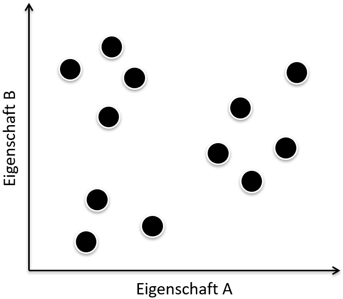
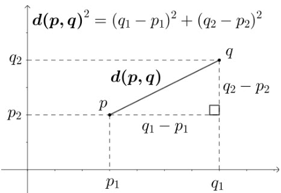
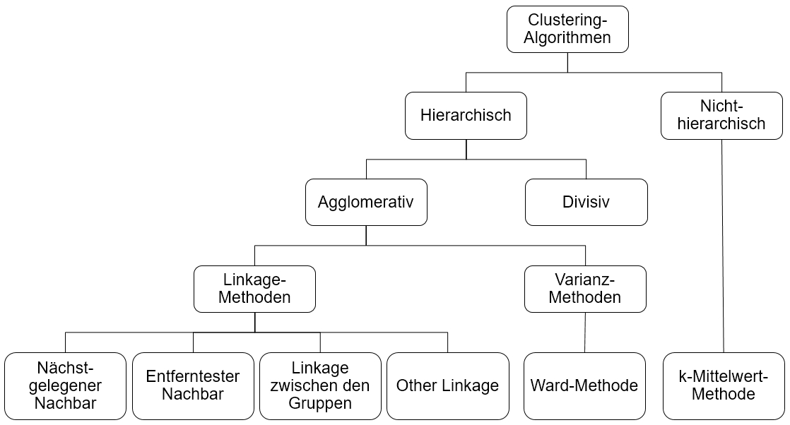
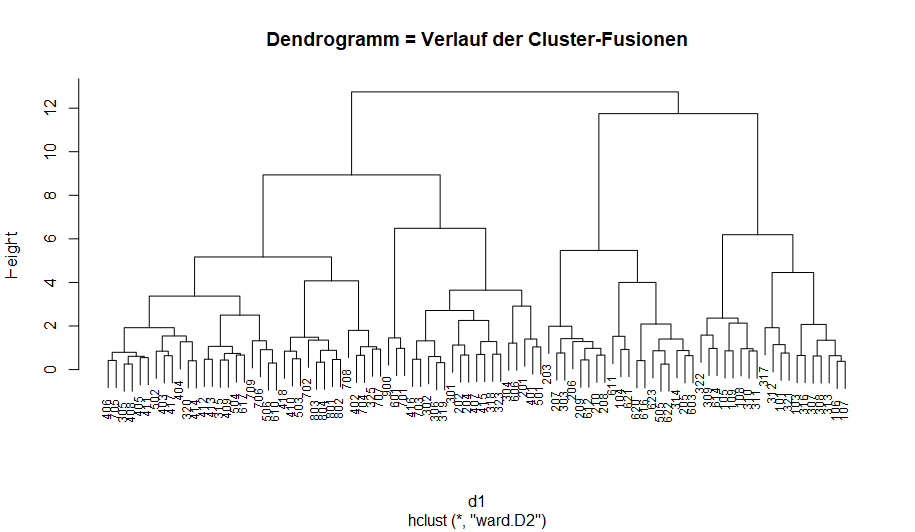
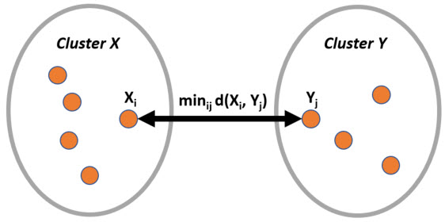

```{r xaringanExtras, echo=FALSE}
xaringanExtra::use_share_again()  # für die Buttons zur Navigation
xaringanExtra::use_tile_view()    # für den Overview auf die Slides
```

# Wo wir gerade stehen

```{r echo=FALSE}
knitr::asis_output('<div class="container">')
knitr::include_graphics ("images/eh4_warmup2/ImageSlide_23_modellieren.png")
knitr::asis_output("</div>")
```

---

class: zwischentitel, center, middle

# .emolarge[🤔]<br>Clusteranalyse?

---

# Warum und wozu Clusteranalyse?

**strukturentdeckende Verfahren:**  
↪ "ähnliche*" Merkmalsträger in Gruppen zusammenfassen

Einige **geographische Beispiele**:

-   um Aktivitäten zur Anpassung an den Klimawandel inhaltlich zu sortieren ([z.B. Grüneis et al. 2018](https://doi.org/10.1016/j.landusepol.2018.08.025));
-   um Verhaltenstypen zur Vorsorge gegenüber Naturgefahren zu unterscheiden ([z.B. Posch et al. 2019](https://doi.org/10.1659/MRD-JOURNAL-D-19-00005.1));
-   oder um Typen ländlicher Räume zu unterscheiden  
([z.B. Höferl et al. 2007](http://www.agit.at/s_c/papers/2007/6228.pdf)).

---

# @ Ähnlichkeit

```{r echo=FALSE}
  knitr::asis_output('<div class="container">')
  
  knitr::asis_output('</div>')
```

---

# Zielsetzung beim Bilden der Gruppen

A. **hohe Intracluster-Homogenität**: Ähnliches in einen Cluster

B. **hohen Intercluster-Heterogenität klar**:  
Cluster klar unterschiedlich

```{r echo=FALSE}
  knitr::asis_output('<div class="container400">')
  knitr::include_graphics("images/eh7_cluster/hetero_homogenitaet_noLegend.png")
  knitr::asis_output('</div>')
```

---

class: zwischentitel, center, middle

# .emolarge[🤔]<br>Wie geht das?

---

# Ablauf einer Clusterung

**Zwei zentrale Arbeitsschritte:**

1.  Zuerst: Ähnlichkeit bzw. Distanz zwischen den zu gruppierenden Merkmalsträgern ermitteln

  + ↪ **Proximitätsmaße**.

2.  Danach: Anhand eines **Gruppierungsverfahrens** gruppierbare (= die "ähnlichsten") Merkmalsträger zusammenfassen

  + ↪ **Fusionsalgorithmen**
  
📚 Mittlerweile gibt es Vielzahl clusteranalytischer Verfahren, die sich hinsichtlich dieser beiden Arbeitsschritte unterscheiden (vgl. Backhaus et al. 2017:438ff.).
---

class: zwischentitel, center, middle

# .emolarge[🤔]<br>Welche Proximitätsmaße gibt es?

---

# .font80[Ein kurzer Überblick auf Proximitätsmaße]

+ **Ziel:** Bestimmung der Ähnlichkeit von Merkmalsträgern

  * Ähnlichkeit = Indikator der je Merkmalsträger über all seine Merkmale hinweg ermittelt und aggregiert wird.
  
+ **Operationalisierung** von "Ähnlichkeit":

  * Ähnlichkeitsmaße wie zB Korrelationen
  
  * Distanzmaße wie zB euklidische Distanz
  
---

# Ausgewählte Ähnlichkeitsmaße

abhänging vom Skalenniveau:

| metrische Merkmale  | nominale Merkmale                 | binäre (0/1) Merkmale                          |
|:----|:----|:----|
| Kosinus             | Transformation in binäre Variable | Würfelmaß (Dice- oder Czekanowski-Koeffizient) |
| Pearson-Korrelation |                                   | Jaccard-Koeffizient                            |
|                     |                                   | M-Koeffizient (einfache Übereinstimmung)       |
|                     |                                   | Kulczynski-Koeffizient                         |
|                     |                                   | Rogers und Tanimoto                            |
|                     |                                   | Russel & Rao (RR) Koeffizient                  |

---

# Ausgewählte Distanzmaße

abhänging vom Skalenniveau:

| metrische Merkmale          | nominale Merkmale | binäre (0/1) Merkmale         |
|:-----------------------------|:-------------------|:-------------------------------|
| (Quad.) Euklidische Distanz | Chi-Quadrat-Maß   | Binäre Euklidische Distanz    |
| Minkowski Metrik            | Phi-Quadrat-Maß   | Lance-Williams-Maß            |
| Block Metrik                |                   | Binäre Form-Differenz         |
| Tschebyscheff Metrik        |                   | Größendifferenz               |
|                             |                   | Varianz                       |
|                             |                   | Rogers und Tanimoto           |
|                             |                   | Russel & Rao (RR) Koeffizient |

---

# Exkurs: ... and there is more

**Wie immer:** Packages bieten natürlich noch mehr Ähnlichkeits- und Distanzmaße 

```{r}
library(philentropy)
getDistMethods()
```

---

# .font70[Wie entscheidet man sich für ein Ähnlichkeitsmaß?]

* **👉 Skalennievau** entscheidet
* danach: situationsabhängig
* Ein (klassisches) Beispiel: **Euklidische Distanz** bei metrischen Variablen

```{r echo=FALSE}
  knitr::asis_output('<div class="container300">')
  
  knitr::asis_output('</div>')
```
.quelle[(Kmhkmh, Wikikmedia, CC BY)]

---

# Exkurs: Euklidische Distanz

Für einen n-dimensionalen (n = Anzahl der Variablen) Fall kann die euklidische Distanz wie folgt ermittelt werden:

$$d_{(p,q)} = \sqrt{\sum_{i=1}^{n}(p_i - q_i)^2}$$

Zur Betonung von Unterschieden in den so ermittelten Distanzen:

**quadrierte euklidische Distanz** $d_{(p,q)}^2$

↪ Betonung der Unterschiedlichkeiten von Merkmalsträgern

---

class: zwischentitel, center, middle

# .emolarge[🤔]<br>Welche Fusionsalgorithmen gibt es?

---

# .font80[Ein kurzer Überblick auf Gruppierungsverfahren]

**Ziel:**  
Merkmalsträger mit geringer Proximität (hohe Ähnlichkeit bzw. geringe Distanz) in Gruppen zusammenfassen bzw. Grundgesamtheit in solche Gruppen zerteilen

```{r echo=FALSE}
  knitr::asis_output('<div class="container350">')
  
  knitr::asis_output('</div>')
```
.quelle[([Universität Zürich](https://www.methodenberatung.uzh.ch/de/datenanalyse_spss/interdependenz/gruppierung/cluster.html))]

---

# Der Klassiker:

**Hierarchisch agglomerative Verfahren**

* Beginn: jeder Merkmalsträger = eigener Cluster
* Ermittlung der Proximität
* Fusion der zwei "ähnlichsten" Cluster
* Ermittlung der Proximität
* Fusion ...
* ...
* Endergebnis: 1 Supercluster (= umfasst alle Merkmalsträger)

---

# Der Klassiker graphisch gedacht:

```{r echo=FALSE}
  knitr::asis_output('<div class="container">')
  
  knitr::asis_output('</div>')
```

---

# .font80[Fusionsalgorithmus &ne; Fusionsalgorithmus]

Das **Single Linkage (aka. "Nächstgelegener Nachbar") Verfahren**:

Bei diesem Verfahren werden die beiden Cluster am ähnlichsten bzw. nähesten zueinander eingestuft, deren Merkmalsträger die geringste Distanz zueinander aufweisen:

```{r echo=FALSE}
  knitr::asis_output('<div class="container200">')
  
  knitr::asis_output('</div>')
```

  + Effekt 1: **Ausreißer** werden sichtbar
  + Effekt 2: "Kettenbildung" bedingt wenige, dafür große Cluster
  
---

# .font80[Fusionsalgorithmus &ne; Fusionsalgorithmus]

Die **Ward Methode**:

Dieses Verfahren fokussiert nicht auf die Distanz von Clusterelementen zueinander, sondern auf die Varianz der Cluster. Ward definiert Varianz dabei als die Summe der quadrierten Abweichungen ("ESS - Error Sum of Squares") der Merkmalsträger in einem Cluster zum Cluster-Mittelwert. 

  + ↪ jene zwei Cluster fusionieren, deren Fusion die **Varianz über alle Cluster** am wenigsten erhöht
  + **Effekt:** gleich große Cluster

```{r include=FALSE}
# Finale: Als PDF ablegen
# pagedown::chrome_print("eh7_cluster_basics.html")
```