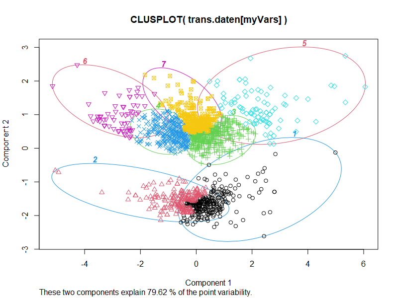

::: {style="margin-bottom:50px;"} 
:::

```{r messen2, echo=FALSE, out.width="600px", fig.align = "center"}

```

::: {style="margin-bottom:50px;"} 
:::

# Howdy*  {.unnumbered}

In diesem WorkBook werden Materialien zur VU "Sozialwiss. Methoden -- How 2 do Things with even more Numbers" (716408) aus dem WS 21-22 angeboten. Diese VU richtet sich an Personen, die

-   Fertigkeiten zur Beschaffung und Aufbereitung quantitativer Daten auffrischen wollen;
-   einen Einblick in Möglichkeiten der multivariaten Auswertung quantiativer Daten mittels R;
-   sowie einen Einblick in die quantitative Auswertung von Textmaterialien mittels R gewinnen wollen.

Sounds good?

{.videoframe}

Let's roll ...

------------------------------------------------------------------------

[](https://creativecommons.org/licenses/by/4.0/deed.de)

Dieses WorkBook und alle darüber angebotenen Materialien (Code, Daten etc.) stehen -- so nicht ausdrücklich anders angegeben -- unter einer [CC BY 4.0](https://creativecommons.org/licenses/by/4.0/deed.de) Lizenz.

\* ... was die Farben angeht: All [their](https://github.com/karthik/wesanderson) fault!
